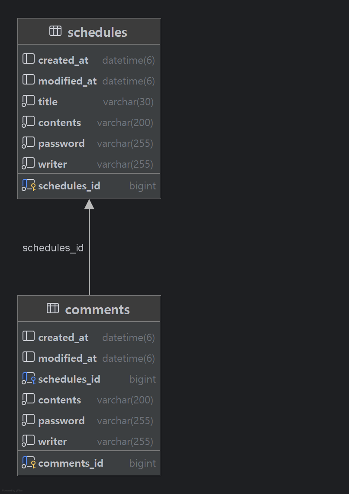

# 일정 관리 앱

간단한 일정(Schedule) CRUD와 비밀번호 검증을 제공한다. 실무 습관에 맞춰 3-Layer 구조, 전역 예외 처리, Validation, 정렬을 지향한다.

Base URL: http://localhost:8080  
작성/수정일 형식 예: 2025-11-03T13:45:12+09:00  
수정/삭제는 비밀번호 검증 필요

--------------------------------------------

## 기능 요약
- 일정 등록/조회/수정/삭제
- 비밀번호 검증 기반 수정·삭제 보호
- 최신순 정렬을 Repository 계층에서 처리
- 전역 예외 처리 통합 관리
- Validation 적용

--------------------------------------------

## 기술 스택
- Java 17, Spring Boot
- Spring Web, Spring Validation
- JPA, MySQL
- Gradle

--------------------------------------------

## 아키텍처
Controller: 요청/응답 DTO 변환  
Service: 비즈니스 규칙 및 비밀번호 검증  
Repository: 정렬, 조회 조건 등 데이터 접근 책임

정렬/카운트 등 데이터 친화 로직은 Repository로 이동시켜 응답 단순화를 유지한다.

--------------------------------------------

## 폴더 구조(예시)
src/main/java/com/example/schedule  
├ schedule  
│  ├ controller  
│  ├ service  
│  ├ repository  
│  └ dto   
├ comment 
│  ├ controller  
│  ├ service  
│  ├ repository  
│  └ dto   
├ exception  
└ config

--------------------------------------------

## 실행 방법
ScheduleApplication에서 실행

--------------------------------------------

## 전역 예외 처리
- @ControllerAdvice 로 전역 처리
- @ExceptionHandler(예외명.class) 로 매핑
- 커스텀 예외:
  PasswordMismatchException  
  CommentNotFoundException
  ScheduleNotFoundException
  MaxCommentLimitException
  

--------------------------------------------

## Validation
- DTO 필드 기준으로 유효성 검사

--------------------------------------------

## 데이터 계층에서의 정렬/카운트 전략
- 최신순 정렬은 Repository 메서드에서 처리:  
  findAllByOrderByCreatedAtDesc()

- 댓글 개수 제한 시 리스트 size로 비교하지 않고  
  countBySchedule(schedule) 으로 DB에서 직접 개수 조회  
  성능 및 코드 간결성 모두 확보

--------------------------------------------

# API 명세서

Base URL: http://localhost:8080  
Resource: schedule  
Content-Type: application/json  
수정/삭제 시 비밀번호 필수  
id, createdAt, modifiedAt 은 서버 생성 필드  
password 는 응답에 포함되지 않음

--------------------------------------------

### 일정 JSON 예시 (응답 형식)
id: 1  
title: 회의  
content: 백엔드 회의  
writer: 민상  
createdAt: 2025-11-03T13:45:12+09:00  
modifiedAt: 2025-11-03T13:50:40+09:00

--------------------------------------------

## 1) 일정 등록
POST /schedule

요청
title, content, writer, password

응답 (201 Created)
id, title, content, writer, createdAt, modifiedAt

--------------------------------------------

## 2) 일정 전체 조회
GET /schedule

응답
content: [Schedule 리스트]

--------------------------------------------

## 3) 일정 단일 조회
GET /schedule/{scheduleId}

응답
단일 Schedule 데이터

--------------------------------------------

## 4) 일정 수정
PUT /schedule/{scheduleId}

요청
title, writer, password

응답
단일 수정된 Schedule 데이터

--------------------------------------------

## 5) 일정 삭제
DELETE /schedule/{scheduleId}

요청
password

응답
성공 메시지

--------------------------------------------

## 에러 응답 예시
비밀번호가 틀렸습니다.
존재하지 않는 일정 입니다.
존재하지 않는 댓글 입니다.
댓글은 최대 10개까지 가능합니다.

--------------------------------------------

# ERD

